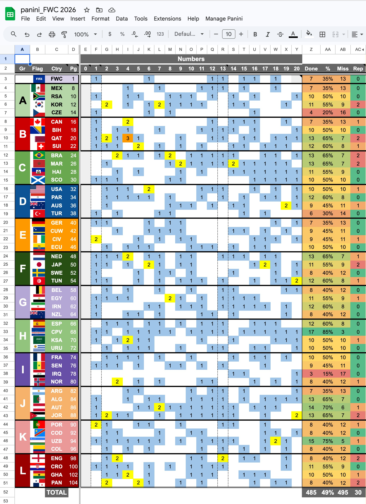
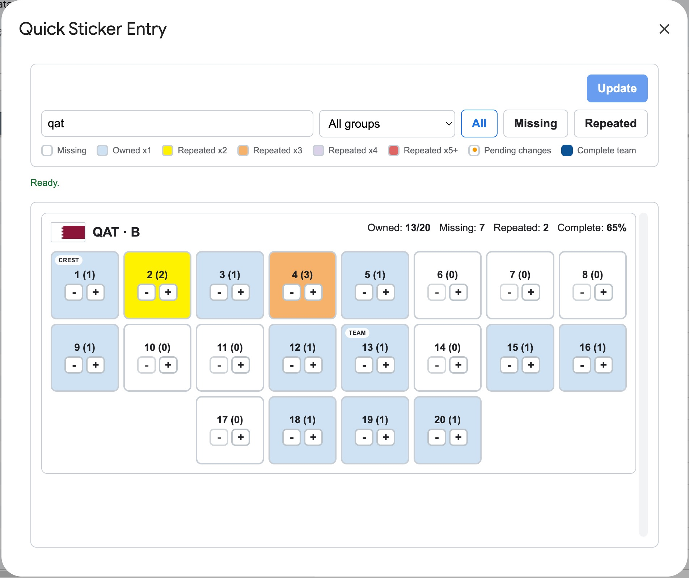
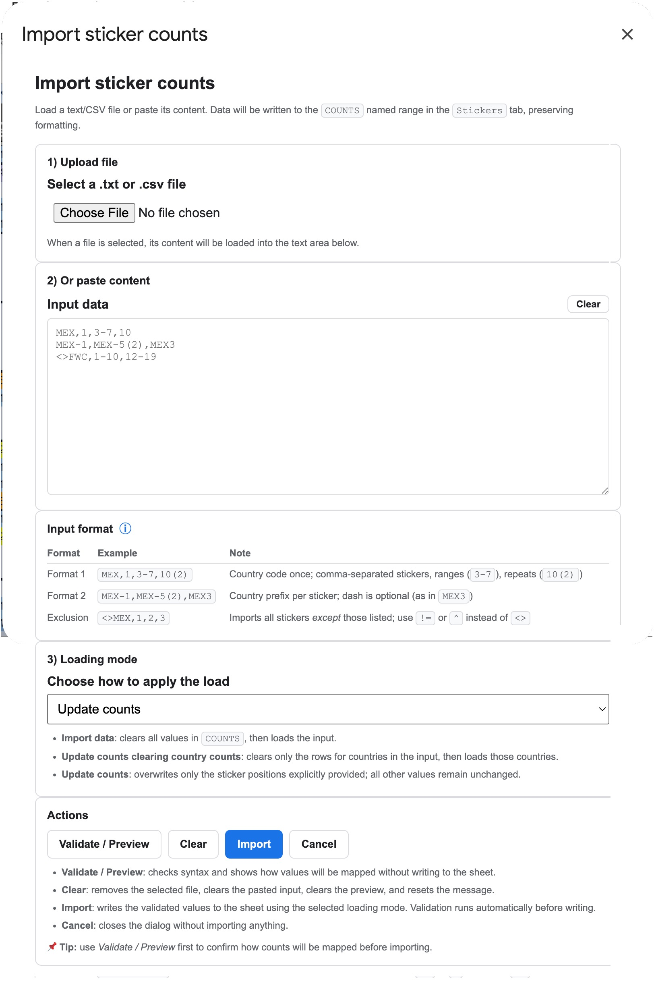
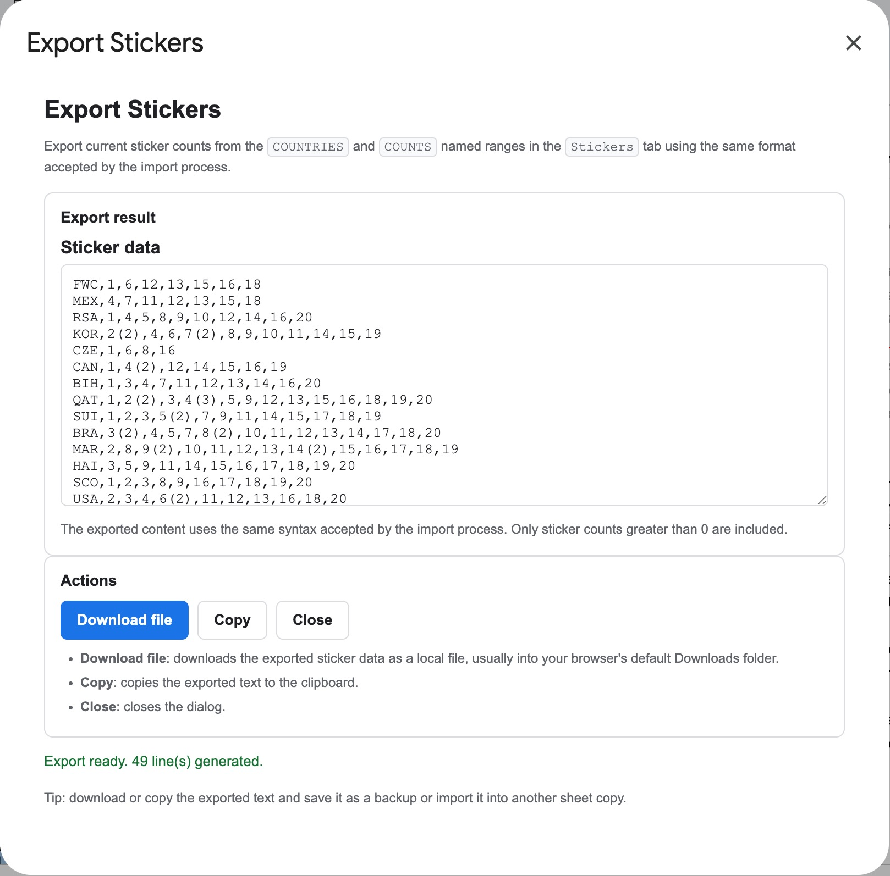
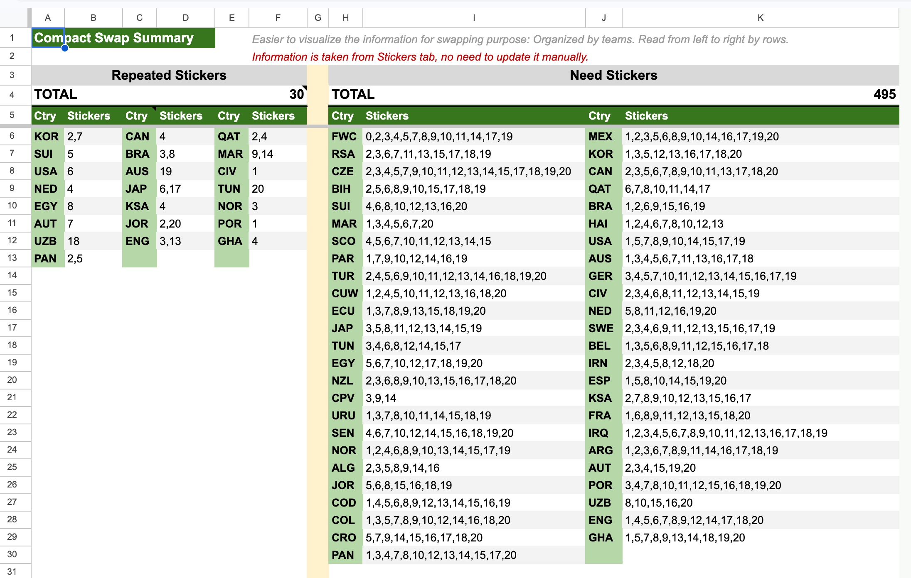
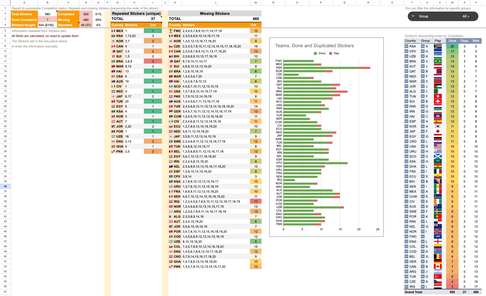
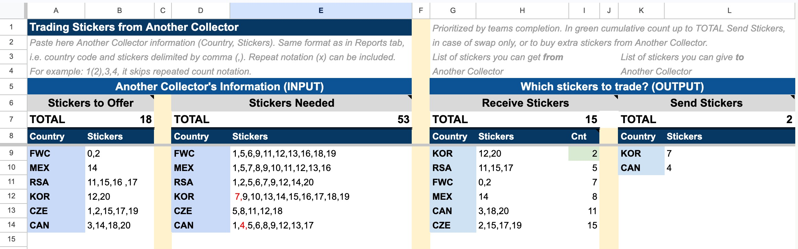
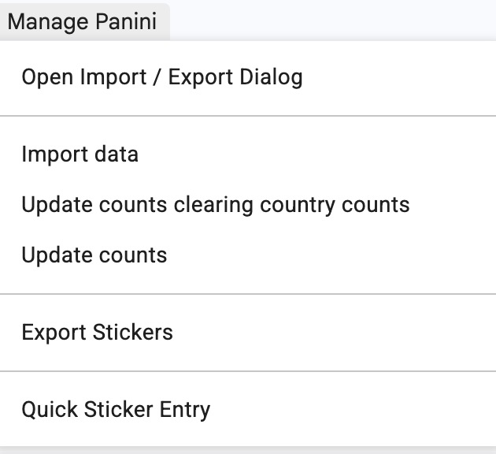

# Panini WC 2026 Google Sheets Tracker

A practical Google Sheets tracker for the **Panini FIFA World Cup 2026** sticker collection.

This project was first published as a draft on [Reddit](https://www.reddit.com/r/Panini/comments/1taj3mn/google_sheet_tracker_for_panini_fifa_wc_2026/), and GitHub is now the main place for source code, documentation, and future updates.

Track your collection, duplicates, missing stickers, swap summary, and possible trades in one spreadsheet.

**Note:** In this document, country code, meaning the code of the soccer team in the Panini album, also includes special sticker groups such as `FWC`. This applies throughout the tracker.

## Live tracker

Use the live Google Sheet here:

```text
https://docs.google.com/spreadsheets/d/15-AosDygdRot_r7dOqZ7gmRlRjnJUS10hlLWkEUkEj8/edit?usp=sharing
```

**Recommended use:** open the sheet and make your own copy.

## Main features

- Track owned stickers in the `Stickers` tab
- Update sticker counts quickly through the **Quick Sticker Entry** dialog
- Import and export sticker data with Google Apps Script tools
- See progress summaries in the `Reports` tab
- Share a compact swap view with other collectors
- Trade with another collector in the `Trade` tab

## Services

### Track your collection

The tracker stores your sticker ownership data in the `Stickers` tab, which acts as the main source for the rest of the spreadsheet. This is where the collection is represented in the same order as the album, making it easier to review and maintain your counts while checking physical stickers.

The `Stickers` tab also includes calculated fields such as `Done`, `%`, `Rep`, and `Miss` so you can quickly understand each team's completion level without leaving the main view.

One support column is hidden `Stickers` tab: `AD`, which stores the country group. This column is required for the Pivot table in the `Reports` tab. Since Pivot tables range input requires a single range, it needs to be part of the `Stickers` tab range.

These support columns are required for derived views and reports, but they are hidden because they are not intended for manual editing.



### Update sticker counts quickly

The **Quick Sticker Entry** dialog provides a faster and more visual way to update the sticker counts stored in the `Stickers` tab. Instead of editing cells manually, you can review one team at a time, filter the visible cards, and increment or decrement counts with dedicated buttons.

This service is enabled through the **Quick Sticker Entry** dialog in the **Manage Panini** menu. The dialog reads from the same data used by the `Stickers` tab and writes updates back to the `COUNTS` named range only when **Update** is pressed.

It is especially useful for day-to-day collection tracking because it combines team progress, missing stickers, repeated stickers, and pending changes in one place.

Main capabilities:
- Search incrementally by **team code** or **country name**
- Filter by **group**
- Filter by sticker status: **All**, **Missing**, or **Repeated**
- Review each team with a compact summary:
  - Owned
  - Missing
  - Repeated
  - Completion percentage
- Update sticker counts with `-` and `+` buttons
- Queue multiple local changes before applying them via the **Update** button
- Highlight pending changes before writing them to the sheet
- Use a color convention for missing and repeated stickers based on count
- Easily identify special cards such as crest and team stickers
- Mark fully completed teams visually



### Import or export collection data

The tracker provides import and export tools so you can load collection data from external sources or create reusable backups of your current sticker counts.

This service is enabled through the **Import / Export** dialog in the **Manage Panini** menu.

#### Import collection data

Import is useful when you already track your collection somewhere else and want to move it into this spreadsheet without manual re-entry.

Available import modes:
- **Import data**: clears all values in the `COUNTS` named range, then loads the input data
- **Update counts clearing country counts**: clears only the rows for countries present in the input, then reloads those countries
- **Update counts**: only overwrites sticker positions explicitly provided in the input, while all other values remain unchanged



#### Export collection data

Export is useful when you want to create a reusable backup, share your current counts, or generate data that can later be imported again.

Export behavior:
- Generates a text representation using the same syntax accepted by the import tool
- Includes only sticker counts greater than 0
- Can be copied or downloaded for reuse



### Share your swap status

The tracker includes a compact swap service that helps you share repeated and missing stickers with other collectors in a concise format.

This service is enabled mainly through the `Compact Swap View` tab. The information is generated automatically from the `Stickers` tab, so no manual input is needed in this view.

It is especially useful when sharing your collection status through messaging apps or social media, where a compact and readable summary is more practical than a full tracker view.



### Review your progress

The tracker provides visual summaries and completion analysis so you can monitor progress across all teams.

This service is enabled mainly through the `Reports` tab, which generates reports and pivot-based summaries from the data entered in the `Stickers` tab. No manual input is required there.

It helps you visualize which teams are closest to completion and review your overall progress from a reporting perspective rather than from the album order used in the `Stickers` tab.



### Trade with another collector

The tracker includes a trade comparison service that helps identify possible exchanges between your collection and another collector's collection.

This service is enabled through the `Trade` tab. Paste the other collector data in the expected format in the **INPUT** section, then review the generated **OUTPUT** section to see what you can offer and what you may receive.

You can use it for trades where both collectors exchange the same number of stickers, or for cases where you receive more stickers and pay the difference. The `Cnt` column in the **OUTPUT** section shows the cumulative number of possible stickers to receive.

Green background highlights values that are lower than or equal to the number of stickers you can send, making it easier to identify equal or smaller trade combinations first. The `TOTAL` value indicates the maximum number of matches on each direction in the **OUTPUT** section. In the **INPUT** section it represents the total counts from Another Collector.



**Note:** For easy visualization, the stickers `KOR,7` and `CAN,4` are manually highlighted in red in this example.

The results are prioritized to support efficient team completion while keeping the trade review process straightforward. In this sample, `KOR` has the highest completion rate among the stickers to trade, which is why it appears at the top of the list in the Receive Stickers table from the **OUTPUT** section. The count `2` from the Receive Stickers table is highlighted with a green background because the total match of the Send Stickers table is `2`. In this case, for a swap, you will *send* the stickers `KOR,7` and `CAN,4` *to* another collector, and *receive* the stickers `KOR,12,20` *from* another collector.

## Manage Panini menu

The custom **Manage Panini** spreadsheet menu is added by the Apps Script project and provides access to the main supported workflows:
- Import or export collection data
- Open the Quick Sticker Entry dialog



## Import / Export tools

### Import format

One country per line:

```text
CODE,number[,number(repeats)]...
```

Please consider the following rules:

- Repeats in parentheses are optional
- Use comma `,` as delimiter
- Country code must exist in the `COUNTRIES` named range in the `Stickers` tab
- Sticker `0` only exists for `FWC`. For other country codes it is accepted and mapped to count `0`
- Sticker `20` only exists for non-`FWC` countries. For `FWC` it is accepted and mapped to count `0`

Example:

```text
FWC,1,3,5(2),7
MEX,18,20
BRA,7(3)
```

In the previous example, sticker `5` for `FWC` appears twice, and sticker `7` for `BRA` appears three times.

### Named ranges used by the script

- `COUNTRIES`: country code column in the `Stickers` tab
- `COUNTS`: sticker counts for stickers `0-20`
- `GROUPS`: team group for each country code
- `FLAGS_URL`: flag image source used by the dialogs
- `COUNTRY_NAMES`: country name used by Quick Sticker Entry incremental search

## Documentation

Service-specific documents are available in the `docs/` folder:

- `docs/ImportExportServiceRequirements.md`: functional requirements and business rules for the import/export service
- `docs/QuickEntryServiceRequirements.md`: functional requirements and business rules for the Quick Sticker Entry service
- `docs/QuickEntryServiceMockDesign.md`: mock design notes and UI behavior references for the Quick Sticker Entry service

## Repository purpose

This repository is the main place for:
- source code
- documentation
- future updates
- improvement history

The project was initially announced on Reddit, but future updates are maintained on GitHub.

## Files

- `Code.gs`: spreadsheet entry points only. It contains menu creation, dialog opening functions, and thin wrapper functions callable from HTML dialogs
- `Commons.gs`: shared spreadsheet access, named range validation, and common lookup utilities used across import/export and Quick Entry flows
- `ImportExportService.gs`: import/export service logic, including preview generation, import execution, export generation, and input parsing
- `QuickEntryService.gs`: Quick Sticker Entry service that builds UI-ready country view models and applies sticker count updates
- `ImportExportDialog.html`: HTML user interface for the combined import/export dialog shown inside Google Sheets
- `QuickEntryDialog.html`: HTML user interface for the Quick Sticker Entry dialog
- `docs/ImportExportServiceRequirements.md`: requirements document for the import/export service
- `docs/QuickEntryServiceRequirements.md`: requirements document for the Quick Entry service
- `docs/QuickEntryServiceMockDesign.md`: mock design document for Quick Entry
- `README.md`: main project overview for GitHub visitors, including features, screenshots, and usage guidance
- `examples/example_sticker-data.txt`: sample data file that can be used both as an import example and as an example of the exported format

## Examples

Example files are available in the `examples/` folder

- `examples/example_sticker`
