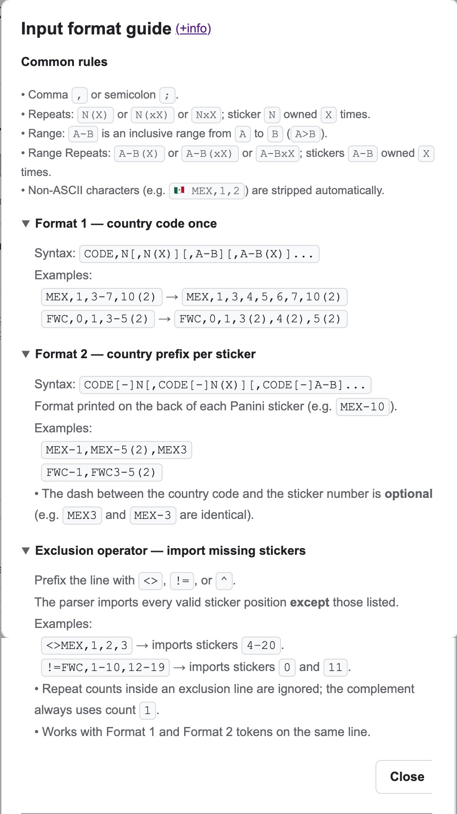

# Panini WC 2026 Google Sheets Tracker

A practical Google Sheets tracker for the **Panini FIFA World Cup 2026** sticker album collection.

This project was first published as a draft on Reddit, and GitHub is now the main place for source code, documentation, and future updates.

Track your collection, duplicates, missing stickers, swap summary, and possible trades in one spreadsheet.

**Note:** In this document, country code means the code of the soccer team in the Panini album and also includes special sticker groups such as `FWC`. This applies throughout the tracker.

**Apps Script disclaimer:** This template uses Google Apps Script for features such as the custom **Manage Panini** menu, the **Import / Export** dialog, and the **Quick Sticker Entry** dialog. Depending on your Google account and authorization state, you may be asked to authorize the script and may see an unverified app warning. For more details, see [Apps Script authorization and Google unverified app warning](#apps-script-authorization-and-google-unverified-app-warning).

## Live tracker

Use the live Google Sheet here:

```text
https://docs.google.com/spreadsheets/d/15-AosDygdRot_r7dOqZ7gmRlRjnJUS10hlLWkEUkEj8/copy
```

Since the URL ends with `/copy`, clicking it creates your own copy of the template.

**Apps Script note:** Some scripted features (**Manage Panini** custom menu) may trigger Google's authorization flow and, for some users, an unverified app warning. See [Apps Script authorization and Google unverified app warning](#apps-script-authorization-and-google-unverified-app-warning) below for details, safety guidance, and review steps.

## Main features

- Track owned stickers (national teams and special `FWC` stickers) in the `Stickers` tab.
- Update sticker counts quickly through the **Quick Sticker Entry** dialog inside the **Manage Panini** custom menu.
- Import and export sticker data via the **Manage Panini** custom menu.
- See progress summaries in the `Reports` tab.
- Share a compact swap view with other collectors in the `Compact Swap View` tab.
- Trade with another collector in the `Trade` tab.

## Out of scope

- Coca-Cola stickers.

## Services

### Track your collection

The tracker stores your sticker ownership data in the `Stickers` tab, which acts as the main source for the rest of the spreadsheet. This is where the collection is represented in the **same order as the album**, making it easier to review and maintain your counts while checking physical stickers.

The `Stickers` tab also includes calculated fields such as `Done`, `%`, `Rep`, and `Miss` so you can quickly understand each team's completion level without leaving the main view.

One support column is hidden in the `Stickers` tab: `AD`, which stores the country group. This column is required for the Pivot Table in the `Reports` tab. Since a Pivot Table's range input requires a single range, it needs to be part of the `Stickers` tab range.


### Update sticker counts quickly

The **Quick Sticker Entry** dialog provides a faster and more visual way to update the sticker counts stored in the `Stickers` tab. Instead of editing cells manually, you can review one team at a time, or multiple visible teams after filtering, and increment or decrement counts with dedicated buttons.

This service is enabled through the **Quick Sticker Entry** dialog in the **Manage Panini** menu. The dialog reads from the same data used by the `Stickers` tab and writes updates back to the `COUNTS` named range only when **Update** is pressed.

It is especially useful for day-to-day collection tracking because it combines team progress, missing stickers, repeated stickers, and pending changes in one place.

Main capabilities:

- Search incrementally by **team code** or **country name**
- Filter by **group**
- Filter stickers based on their status: **All**, **Missing**, **Repeated**, or **Pending** (pending changes that haven't been committed via the **Update** button yet).
- Review each team with a compact summary:
  - Owned
  - Missing
  - Repeated
  - Completion percentage
- Update sticker counts with `-` and `+` buttons
- Queue multiple local changes before applying them via the **Update** button
- Highlight pending changes before writing them to the sheet
- Use a color convention for missing and repeated stickers based on count. The colors are the same as those used in the `Stickers` tab and specified in the **Legend** section of the Description in the same tab.
- Easily identify special cards such as crest and team stickers
- Mark fully completed teams visually


### Import or export collection data

The tracker provides import and export tools so you can load collection data from external sources or create reusable backups of your current sticker counts.

This service is enabled through the **Import / Export** dialog in the **Manage Panini** menu. The format is Comma-Separated Values (CSV) in both directions (it accepts `;` instead of `,`).

#### Import collection data

Import is useful when you already track your collection elsewhere and want to move it into this spreadsheet without manual re-entry. After the import is executed, **only** valid imported values are written to the `COUNTS` named range in the `Stickers` tab.

Available import modes:

- **Import data**: clears all values in the `COUNTS` named range, then loads the input data.
- **Update counts clearing country counts**: clears only the rows for countries present in the input, then reloads those countries.
- **Update counts**: only overwrites sticker positions explicitly provided in the input, while all other values remain unchanged.

The formats supported are detailed in the input view:


If you click on the help icon (ⓘ), it shows more detailed information about the import formats and rules:




> Note: Clicking the (+info) link opens this document (`README.md`) in a new browser tab.

#### Export collection data

Export is useful when you want to create a reusable backup, share your current counts, or generate data that can later be imported again.

Export behavior:

- Generates a text representation using the same syntax accepted by the import tool (Format 1 with the ranges expanded)
- Exports only valid sticker numbers:
  - `[0-19]` for `FWC` stickers.
  - `[1-20]` for team country stickers (non-`FWC`).
- The exported content can be copied or downloaded for reuse.
- Allows the user to decide whether to include flag icons in the export.


### Share your swap status

The tracker includes a compact swap view that helps you share repeated and missing stickers with other collectors in a concise format.

This service is enabled mainly through the `Compact Swap View` tab. The information is generated automatically from the `Stickers` tab, so no manual input is needed in this view.

It is especially useful when sharing your collection status through messaging apps or social media, where a compact and readable summary is more practical than a full tracker view.


### Review your progress

The tracker provides visual summaries and completion analysis so you can monitor progress across all teams.

This service is enabled mainly through the `Reports` tab, which generates reports and pivot-based summaries from the data entered in the `Stickers` tab. No manual input is required there.

It helps you identify which teams are closest to completion and review your overall progress from a reporting perspective rather than by album order as shown in the `Stickers` tab.


### Trade with another collector

The tracker includes a trade comparison service that helps identify possible exchanges between your collection and another collector's collection.

This service is enabled through the `Trade` tab. Paste the other collector's data in the expected format in the **INPUT** section, then review the generated **OUTPUT** section to see what you can offer and what you may receive. You can optionally include flag icons before country codes.

You can use it for trades where both collectors exchange the same number of stickers, or for cases where you receive more stickers and pay the difference. The `Cnt` column in the **OUTPUT** section shows the cumulative number of possible stickers to receive/send.

A green background highlights values that are less than or equal to the number of stickers you can send or receive, making it easier to identify balanced or smaller trade combinations first. The `TOTAL` value indicates the maximum number of matches in each direction in the **OUTPUT** section. In the **INPUT** section, it represents the total counts from Another Collector.


In the **OUTPUT** section, you can sort the Receive Sticker output by either `%-Done` or `Album`. This dropdown menu is located next to the **SORT** label.

- **%-Done**: This sorting prioritizes stickers with the closest completion status. By sorting by `%-Done`, you can easily identify and collect stickers that are close to completion, helping you finish your team more efficiently. However, for large exchanges, it can be challenging to find specific stickers since they aren't organized in the same way as albums. Collectors often maintain a list of repeated stickers in the same order as the album.

- **Album**: This sorting option maintains the order of stickers as they appear in the album. This is particularly useful for large numbers of stickers to swap, making the process more streamlined and efficient.

In the provided example, the maximum swap occurs when the cumulative number of stickers is `9`, meaning both collectors receive an equal number of stickers. This number represents the minimum `TOTAL` in both directions. You can also negotiate with another collector to send additional stickers and receive compensation for the difference.

📌 This entire process is significantly simplified by the information provided in this tab.

## Manage Panini menu

The custom **Manage Panini** spreadsheet menu is added by the Apps Script project and provides access to the main supported workflows:

- Import or export collection data
- Open the Quick Sticker Entry dialog


## Import / Export tools

### Import format

The input parser considers two formats: Format 1 and Format 2. Examples:

- Format 1:
  - `MEX,1,2,3(2)` → sticker `3` is repeated `2` times.
  - 🇲🇽 `MEX,1,2,3(3)` → sticker `3` is repeated `3` times.
  - `MEX,1-3` → same as: `MEX,1,2,3`.
  - `MEX,1-3(2)` → same as: `MEX,1(2),2(2),3(2)`.
- Format 2: Similar to the sticker ID on the back of the sticker card
  - `MEX-1,MEX-2,MEX3` → the dash (`-`) is optional, as in `MEX3`.
  - 🇲🇽 `MEX-1,MEX-9-10` → same as: `MEX-1,MEX-9,MEX-10`.
  - `MEX-1,MEX-9-10(2)` → same as: `MEX-1,MEX-9(2),MEX-10(2)`.

All valid sticker values produced after parsing and validation are written to the `COUNTS` named range.

### Common syntax rules

All formats enforce the following syntax rules (for simplicity, all examples use Format 1, but the rules apply to both formats):

- Accepted delimiters between tokens are `,` (comma) and `;` (semicolon), but internally semicolons are converted to commas as part of the normalization process.
- All whitespace and non-ASCII characters are stripped from each line before parsing; flag emojis are removed as part of the normalization process.
- One country per line.
- *First country rule*: The first mandatory token in the country line must be a country code; all stickers belong to this country code.
- Country codes must exist in the `COUNTRIES` named range. Invalid countries are skipped and a warning is reported.
- A sticker token must be one of the following:
  - `N` sticker number. The number must be in the valid range: `[0-20]`. Outside this range, the sticker is skipped and reported as a warning. Sticker not in the album such as `FWC-20` or non-`FWC-0` are accepted on input if present and populated as `0` count.
  - `N(X)` sticker number repeated `X` times where `X > 1` (otherwise skipped and a warning is reported).
  - `A-B` sticker range from `A` to `B`, both inclusive, where `A` is lower than `B` (otherwise skipped and a warning is reported).
  - `A-B(X)` sticker range with repeats. Same as `A-B` case but repeats `X` times for each sticker in the range.
- *First-occurrence-wins rule*: The first occurrence is kept in the case of duplicated stickers within the same country line or duplicated country lines (two lines belong to the same country). Skipped stickers and country lines are reported as warnings:
  - *Duplicates*: `MEX,1,1(2),2,3` → `MEX,1,2,3`; sticker `1(2)` is skipped and reported as a warning.
  - *Duplicates in overlapping ranges*: `MEX,1-3,3-5(2)` is expanded internally as `MEX,1,2,3,3(2),4(2),5(2)`; therefore, the second occurrence of sticker `3` (`3(2)`) is skipped and reported as a warning.
  - *Duplicated country lines*: If a line contains `MEX,1,2,3` and down below another line contains `MEX,10,11,13`, the second line is skipped and reported as a warning.

### Format 1 (country code once)

Country line:

```text
Format: [flag] CODE,number[,number(repeats)][,number-range][,number-range(repeats)]...
```

Please check **Common syntax rules** for the validation rules that apply.

In case you are not familiar with format notation:

- `[]` brackets mean optional; therefore:
  - Icon flag: `[flag]` is optional.
  - Repeats: `[,number(repeats)]` in parentheses are optional.
  - Ranges: `[,number-range]` are optional.
- Use comma `,` as the delimiter. Note: `;` can be used, but it is converted to `,` as part of the normalization process on input.

Example:

```text
FWC,1,3,5(2),7
🇲🇽 MEX,18,20
BRA,7(3)
RSA,10-12(2)
```

In the previous example, the collector has two copies of sticker `5` for `FWC`. For `BRA`, the collector has sticker `7` three times. For `RSA`, the collector has stickers `10` through `12` two times each.

### Format 2 (Per-sticker country prefix (CODE[-]N))

Each sticker token includes the country code as a prefix. The dash between the code and the sticker number is **optional**. All current country codes in the Panini WC 2026 album are exactly three characters long on the back of the sticker card; the parser relies on this fixed length to identify the code prefix in Format 2 tokens.

```text
Format: [flag] CODE[-]N[,CODE[-]N(repeats)][,CODE[-]A-B][,CODE[-]A-B(repeats)]...
```

Where `CODE[-]` means the country code followed by an optional dash.

Please check **Common syntax rules** and the previous section to understand the format notation if you are not familiar with it.

The *First country rule* from the **Common syntax rules** section enforces that any country different from the first one in the country line is skipped and reported as a warning. For example: `MEX1,MEX10,BRA10,ARG10,MEX20` results in `MEX1,MEX10,MEX20`, and stickers `BRA10` and `ARG10` are skipped and reported as warnings.

Example:

```text
FWC1,FWC-3,FWC-5(2),FWC-7
🇲🇽 MEX-18,MEX-20
BRA7(3)
RSA-10-12(2)
```

Same interpretation as in the example from the **Format 1** section.

### Exclusion operator (import indicating missing cards only)

The exclusion operator allows a collector to import only the stickers they are **missing**, instead of listing all the stickers they own. It is convenient when the album is close to completion and it is easier to indicate only what is missing. When a collection is close to completion, collectors can import missing stickers first and then perform a second import for repeated stickers, simplifying data entry while still building a complete collection record.

### Supported operator symbols

The following operator symbols are equivalent and interchangeable:

| Symbol | Background |
| --- | --- |
| `<>` | Spreadsheet users (Google Sheets / Excel not-equal operator) |
| `!=` | JavaScript / Java developers |
| `^` | Regex / set-complement notation |

### Exclusion operator syntax

The operator prefix may be applied to any valid import line format:

```text
<OPERATOR> CODE,number[,number(repeats)][,start-end][,start-end(repeats)]...   (Format 1)
<OPERATOR> CODE[-]N[,CODE[-]N(repeats)][,CODE[-]A-B][,CODE[-]A-B(repeats)]...  (Format 2)
```

### Exclusion examples

| Input | Equivalent (stickers imported) |
| --- | --- |
| `<>MEX,1,2,3` | `MEX,4,5,6,7,8,9,10,11,12,13,14,15,16,17,18,19,20` |
| `<>MEX,1,MEX-5-7` | `MEX,2,3,4,8,9,10,11,12,13,14,15,16,17,18,19,20` |
| `<>MEX,1(2),MEX-5-7(2)` | Same as `<>MEX,1,MEX-5-7` (previous row) |
| `<>FWC,1-10,12-19` | `FWC,0,11` |
| `!=MEX,1,2,3` | `MEX,4,5,6,7,8,9,10,11,12,13,14,15,16,17,18,19,20` |
| `^MEX1,MEX2,MEX3` | `MEX,4,5,6,7,8,9,10,11,12,13,14,15,16,17,18,19,20` |

### Exclusion operator validation rules

- The operator must appear only at the start of the line, immediately before the first country code token.
- If more than one operator symbol appears at the start of the line, only the first is recognized; the remainder are silently ignored.
- An exclusion line must contain at least one sticker token after the country code; if no sticker tokens are present, the line is skipped and a warning is issued. To import all stickers for a country, use the explicit form `CODE,1-20` (or `FWC,0-19`) instead.
- If the exclusion results in an empty set (all valid positions excluded), the line produces no sticker entries and a warning is issued.
- Repeat values, if present in an exclusion line, are ignored — the complement always assigns count `1` to each resulting sticker position, and no warning is issued.

> Note: This operation is intended to facilitate user entry, but internally it is converted into Format 1.

## Named ranges used by the script

- `COUNTRIES`: country code column in the `Stickers` tab.
- `COUNTS`: sticker counts for stickers `0-20`.
- `GROUPS`: team group for each country code.
- `FLAGS_URL`: flag image source used by the dialogs.
- `COUNTRY_NAMES`: country name used by Quick Sticker Entry incremental search.

## Hidden tabs

- `Conf`: Country-specific information such as flag, ISO country code, icon, name, etc.

## Apps Script authorization and Google unverified app warning

This tracker includes Google Apps Script features such as:

- the custom **Manage Panini** menu.
- the **Import / Export** dialog.
- the **Quick Sticker Entry** dialog.

When you make your own copy of the spreadsheet and run one of these features for the first time, Google may ask you to authorize the attached Apps Script project. Depending on your Google account type and Google's OAuth rules, you may also see an **unverified app** warning in the web browser authorization flow.

See the [Step-by-Step Guide](docs/GoogleAccessStepByStep.md), which explains how to create a copy of the tracker and authorize the Apps Script project. If you have additional questions or concerns about using this Apps Script, please check the [FAQ](docs/FAQ.md).

### Recommended safety steps before authorizing

If you are unsure, you can take these steps before approving access:

1. **Make your own copy** of the spreadsheet.
2. Open **Extensions → Apps Script**.
3. Review the attached script project.
4. Compare it with the source code published in this repository.
5. Authorize it only if you are comfortable with what it does.

If you prefer not to authorize the script, you can still use the spreadsheet manually without scripted features.

## Documentation

Service-specific documents are available in the `docs/` folder:

- `ImportExportServiceRequirements.md`: functional requirements and business rules for the import/export service.
- `QuickEntryServiceRequirements.md`: functional requirements and business rules for the Quick Sticker Entry service.
- `QuickEntryServiceMockDesign.md`: mock design notes and UI behavior references for the Quick Sticker Entry service.
- `TechnicalArchitecture.md`: comprehensive technical overview of the system architecture, file structures, development lifecycle pipelines, and core engineering design constraints governing the project.

## Testing

Since version `1.0.2`, Apps Script artifacts have been tested in a VS Code `Node.js` project using `Jest`. For more information, please check `docs/TechnicalArchitecture.md`.

## Changelog

Project history and notable updates are documented in:

- `CHANGELOG.md`

## Repository purpose

This repository is the main place for:

- source code
- testing artifacts
- documentation
- future updates
- improvement history

The project was initially announced on Reddit, but GitHub is now the primary location for ongoing development, documentation, and updates.

## Files

- Under `src` folder:
  - `Code.gs`: spreadsheet entry points only. It contains menu creation, dialog opening functions, and thin wrapper functions callable from HTML dialogs.
  - `Commons.gs`: shared spreadsheet access, named range validation, and common lookup utilities used across import/export and Quick Entry flows.
  - `ImportExportService.gs`: import/export service logic, including preview generation, import execution, export generation, and input parsing.
  - `QuickEntryService.gs`: Quick Sticker Entry service that builds UI-ready country view models and applies sticker count updates.
- Under `src/html` folder:
  - `ImportExportDialog.html`: HTML user interface for the combined import/export dialog shown inside Google Sheets.
  - `QuickEntryDialog.html`: HTML user interface for the Quick Sticker Entry dialog.
  - `QuickEntryDialogHelpers.html`: helper logic functions used in `src/html/QuickEntryDialog.html`.
  - `QuickEntryDialogRender.html`: DOM/UI-specific functions used in `src/html/QuickEntryDialog.html`.
- Under `test/` folder:
  - `Commons.unit.test.js`: test file for testing `src/Commons.gs`.
  - `ImportExportService.unit.test.js`: test file for testing `src/ImportExportService.gs`.
  - `ImportExportHelpers.unit.test.js`: test file for testing `src/html/ImportExportDialogHelpers.gs`.
  - `QuickEntryService.unit.test.js`: test file for testing `src/QuickEntryService.gs`.
  - `QuickEntryDialogHelpers.unit.test.js`: test file for testing `src/html/QuickEntryDialogHelpers.gs`.
  - `QuickEntryDialogRender.unit.test.js`: test file for testing `src/html/QuickEntryDialogRender.gs`.
  - `fixtures/createValidRanges.js`: creates valid default named-range configuration for repository tests.
  - `utils/testKernel.js`: global test kernel for GAS unit tests.
  - `test/jest.config.js`: `Jest` configuration file.
- Under `scripts` folder:
  - `build.js`: prepares the `src/*.gs` and `src/html/*Dialog[Helpers|Render].html` files to be tested with Jest.
  - `clasp.zsh`: zsh script to handle `clasp` operations (`pull`/`push`) to synchronize the local VS Code environment with the GAS remote server repository. It creates a preventive backup zip file before updating the source code (local/server).
  - `fix-jsdoc.js`: used occasionally when `eslint` doesn't fit short JSDoc comments into a single line and instead generates three-line comments.
- Under `docs` folder:
  - `ImportExportServiceRequirements.md`: requirements document for the import/export service.
  - `QuickEntryServiceRequirements.md`: requirements document for the Quick Entry service.
  - `QuickEntryServiceMockDesign.md`: mock design document for Quick Entry.
  - `GoogleAccessStepByStep.md`: step-by-step guide to help you get a copy of the template and provide access to the Apps Script project.
  - `TechnicalArchitecture.md`: comprehensive technical overview of the system architecture, file structure, development lifecycle pipelines, and core engineering design constraints governing the project.
  - `FAQ.md`: Frequently Asked Questions document. It includes questions related to Google security and access for Apps Script.
- Under root:
  - `clasp.json.template`: template file used for `clasp` operations (create, edit, and deploy locally to Apps Script).
  - `.claspignore`: files and folders to ignore in `clasp` execution.
  - `.eslintignore`: files and folders to ignore by `eslint`.
  - `.eslintrc.js`: `eslint` configuration (customizable rules).
  - `.gitignore`: files and folders to ignore for `git`.
  - `jsconfig.json`: JavaScript project configuration file.
  - `package.json`: Node.js project configuration file (dependencies, scripts, automation tasks, etc.).
  - `CHANGELOG.md`: chronological summary of notable project changes.
  - `README.md`: main project overview for GitHub visitors, including features, screenshots, and usage guidance.
  - `TODO.md`: features planned for future releases. The check mark indicates if a feature has already been implemented.
