# Panini WC 2026 Google Sheets Tracker

A practical Google Sheets tracker for the **Panini FIFA World Cup 2026** sticker album collection.

This project was first published as a draft on [Reddit](https://www.reddit.com/r/Panini/comments/1taj3mn/google_sheet_tracker_for_panini_fifa_wc_2026/), and GitHub is now the main place for source code, documentation, and future updates.

Track your collection, duplicates, missing stickers, swap summary, and possible trades in one spreadsheet.

**Apps Script disclaimer:** This template uses Google Apps Script for features such as the custom **Manage Panini** menu, the **Import / Export** dialog, and the **Quick sticker entry** dialog. Depending on your Google account and authorization state, you may be asked to authorize the script and may see an unverified app warning. For more details, see [Apps Script authorization and Google unverified app warning](#apps-script-authorization-and-google-unverified-app-warning). You can use it without using **Manage Panini** custom menu services so it doesn't require authorization, but you will not take advantage of the full potential of ths tracker.

## Live tracker

Use the live Google Sheet here:

```text
https://docs.google.com/spreadsheets/d/15-AosDygdRot_r7dOqZ7gmRlRjnJUS10hlLWkEUkEj8/copy
```

Since the URL ends with `/copy`, clicking it creates your own copy of the template.

**Apps Script note:** Some scripted features (**Manage Panini** custom menu) may trigger Google's authorization flow. 

---

## Main features

- Track owned stickers from country teams and special `FWC` (FIFA World Cup), and `CC` (Coca-Cola) stickers in the `Stickers` tab.
- Update sticker counts quickly through the **Quick sticker entry** dialog inside the **Manage Panini** custom menu.
- Import and export sticker data via the **Manage Panini** custom menu.
- Export a shared list of stickers for trading in text format to easily share with other collectors via the **Manage Panini** custom menu.
- See progress summaries in the `Reports` tab.
- Share a compact swap view with other collectors in the `Compact Swap View` tab.
- Trade with another collector in the `Trade` tab finding the match ready to trade.
- Expose **Manage Panini** services for desktop (Google Sheet) and mobile via browser.

---

## Out of scope

- Mobile app, the services is provided via browser in mobile devices.

---

## Services

### Track your collection

The tracker stores your sticker ownership data in the `Stickers` tab, which acts as the main source for the rest of the spreadsheet. This is where the collection is represented in the **same order as the album**, making it easier to review and maintain your counts while checking physical stickers.

The `Stickers` tab also includes calculated fields such as `Done`, `%`, `Rep`, and `Miss` so you can quickly understand each team's completion level without leaving the main view.

One support column is hidden in the `Stickers` tab: `AD`, which stores the country group. This column is required for the Pivot Table in the `Reports` tab. Since a Pivot Table's range input requires a single range, it needs to be part of the `Stickers` tab range.

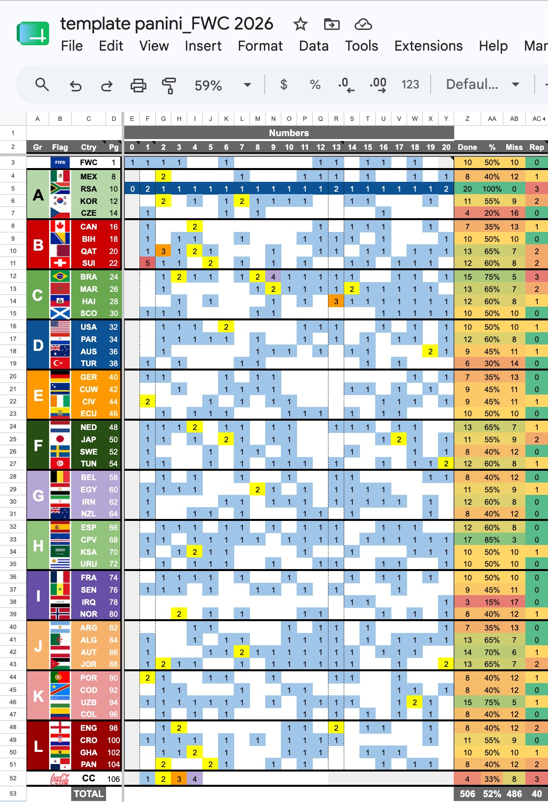

**Note:** In this document, country code means the code of the soccer team in the Panini album and also includes special sticker groups such as `FWC` and `CC`. This applies throughout the tracker.

### Update sticker counts quickly

The **Quick sticker entry** dialog provides a faster and more visual way to update the sticker counts stored in the `Stickers` tab. Instead of editing cells manually, you can review one team at a time, or multiple visible teams after filtering, and increment or decrement counts with dedicated buttons.

This service is enabled through the **Quick sticker entry** dialog in the **Manage Panini** menu. The dialog reads from the same data used by the `Stickers` tab and writes updates back to the `COUNTS` named range only when **Update** is pressed.

It is especially useful for day-to-day collection tracking because it combines team progress, missing stickers, repeated stickers, and pending changes in one place.

Main capabilities:

- Search incrementally by **country code** or **country name**
- Filter by **group**
- Filter stickers based on their status: **All**, **Missing**, **Repeated**, or **Pending** (pending changes that haven't been committed via the **Update** button yet).
- Review each team with a compact summary:
  - Owned
  - Missing
  - Repeated
  - Completion percentage
- Update sticker counts with `-` and `+` buttons
- Queue multiple local changes before applying them via the **Update** button
- Highlight pending changes before writing them to the sheet
- Use a color convention for owned, missing and repeated stickers based on count. The colors are the same as those used in the `Stickers` tab and specified in the **Legend** section of the Description in the same tab.
- Easily identify special cards such as crest and team stickers
- Mark fully completed teams visually with blue background.

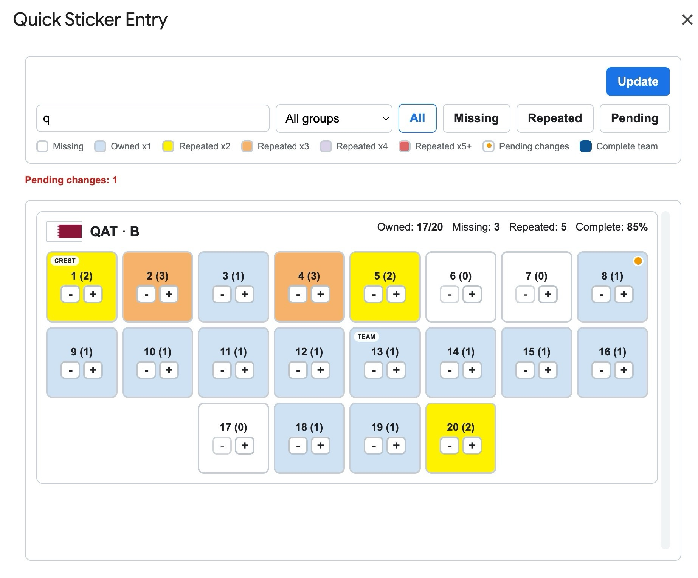

### Import collection data

The tracker provides import tool so you can load collection data from external sources or create reusable backups of your current sticker counts.

This service is enabled through the **Import** dialog in the **Manage Panini** custom menu. The import format is Comma-Separated Values (CSV). It also accepts `;` (semicolon) , `:` (colon), or whitespace as delimiters, but internally converts them into `,` delimiter.

Import is useful when you already track your collection elsewhere and want to move it into this spreadsheet without manual re-entry. After the import is executed, **only** valid imported values are written to the `COUNTS` named range in the `Stickers` tab.

Another useful use case is when the user wants to upgrade this tracker, using a recent version, then export the data from the previous version and import into the new version tracker.

Available import modes:

- **Import data**: clears all values in the `COUNTS` named range, then loads the input data.
- **Update counts clearing country counts**: clears only the rows for countries present in the input, then reloads those countries.
- **Update counts**: only overwrites sticker positions explicitly provided in the input, while all other values remain unchanged.

The **Open import dialog** allows the user to select the import mode via: **Choose how to apply the load** drop-down:

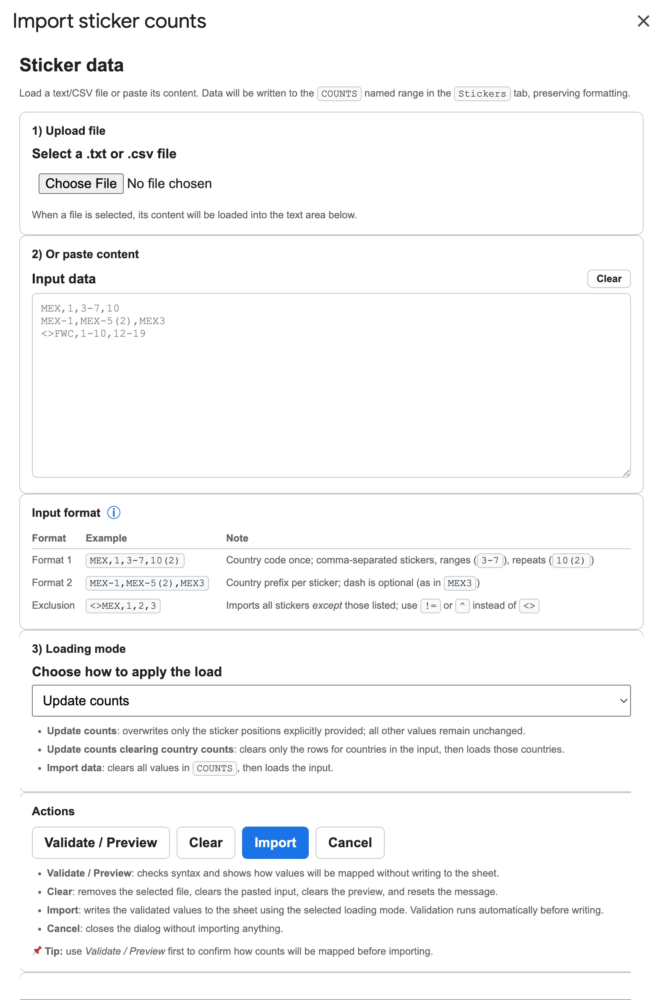

After click on the help icon (ⓘ), it shows more detailed information about the import formats and rules:

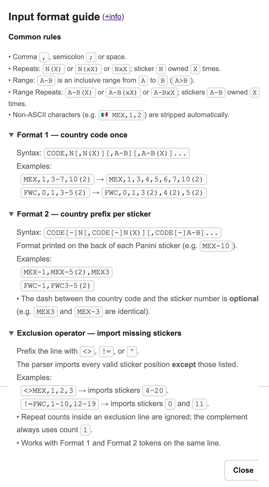

Check the session **Input format** for more details.

> Note: Clicking the (+info) link opens this document (`README.md`) in a new browser tab.

### Export all stickers

Export is useful when you want to create a reusable backup, share your current counts, or generate data that can later be imported again. The user can get to this service via **Manage Panini** custom menu, by clicking on the service: **Export all stickers**.

Export behavior:

- Generates a text representation using the same syntax accepted by the import tool (Format 1, check the session **Input format** for more details)
- Exports only valid sticker numbers:
  - `[0-19]` for `FWC` stickers.
  - `[1-12]` for `CC` (Coca-Cola) stickers
  - `[1-20]` for team country stickers.
- The exported content can be copied or downloaded for reuse.

The service allows the user to customize the output data via the following checkboxes:
- **Flag**: Before the country code the icon flag (emoji) is added.
- **Compact (using ranges)**: The data generated is compacted via range, i.e. `1,2,3` → `1-3` which results in a more compact view.

The change in the output will be reflected when the user clicks the **Refresh** button.

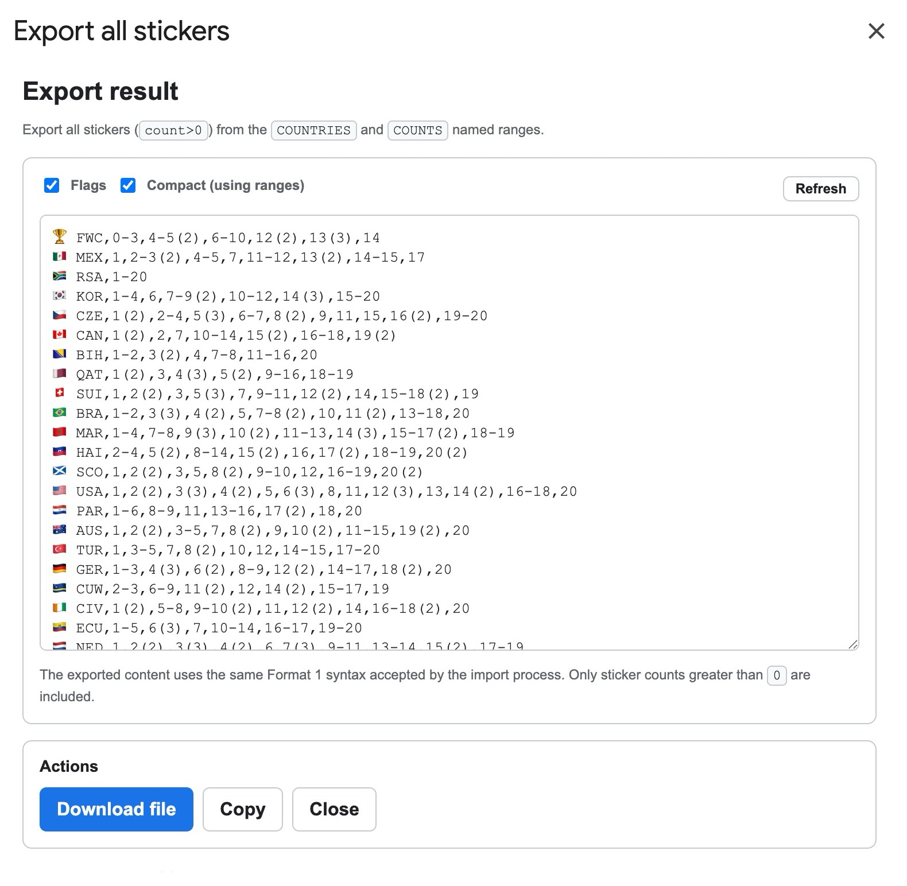

### Export shared stickers

The user can share the list of repeated and missing stickers for trading purposes in a friendly format. The output is intended to be shared via SMS or any other text-based medium. The user gets access to this service via **Manage Panini** custom menu by clicking on **Export shared stickers**.

The output data will be as follows:

```text
Output generated by: https://bit.ly/panini-wc2026-gsheet-tracker

🔄 Repeated stickers
MEX,6,7,9,11,14
RSA,1,4,5,8,20
KOR,2,7,8,9,14

❌ Missing stickers
MEX,1,2,3,5,10,20
RSA,2,3,6,7
KOR,1,3,5,13,16
```

> The link shown at the top points to this GitHub project.

The user can customize the output via the following checkboxes:

- **Flag**: Before the country code the icon flag (emoji) is added.
- **Compact (using ranges)**: The data generated is compacted via range, i.e. `1,2,3` → `1-3` which results in a more compact view.
- **Sort by Done (descending) missing stickers**: Sorts the output of missing stickers by %-completion in descending order. This helps prioritize, during the trading process, teams that are close to completion.

The change in the output will be reflected when the user clicks the **Refresh** button.

The export format is Format 1 (refer to the session **Input format** for more details), excluding repeats. For instance, if a collector has the sticker `2` three times, it will be displayed as `2`, not `2(3)`. In the context of trading, the number of repeats a collector has is irrelevant in the Repeated sticker list.

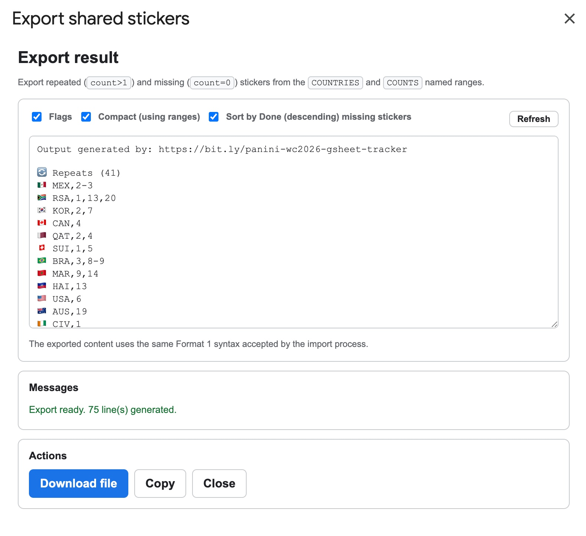

### Share your swap status

The tracker includes a compact swap view that helps you share repeated and missing stickers with other collectors in a concise format.

This service is enabled mainly through the `Compact Swap View` tab. The information is generated automatically from the `Stickers` tab, so no manual input is needed in this view.

It is especially useful when sharing your collection status through messaging apps or social media, where a compact and readable summary is more practical than a full tracker view focused on repeated and missing stickers for trading purposes.

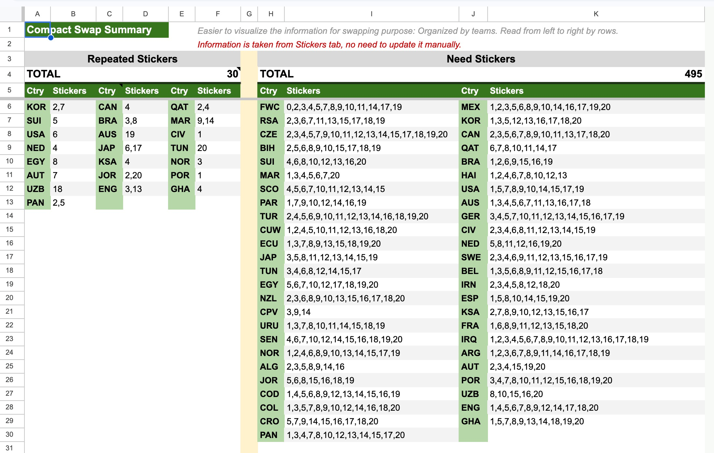

The output of Need Stickers can be sorted, look for the drop-down value to the right of `SORT`:

- **%-Done**: This sorting prioritizes stickers with the closest completion status. By sorting by `%-Done`, you can easily identify and collect stickers that are close to completion, helping you finish your team more efficiently. This sorting affects the stickers you are going to receive from another collector (Receive Stickers columns) only. However, for large exchanges, it can be challenging to find specific stickers since they aren't organized in the same way as album. Collectors often maintain a list of repeated stickers in the same order as the album.

- **Album**: This sorting option maintains the order of stickers as they appear in the album. This is particularly useful for large numbers of stickers to swap, making the process more streamlined and efficient.


> This export view provides information similar to the **Export shared stickers** service from **Manage Panini**. It is intended for sharing with other collectors using Google Sheets or Excel trackers, or simply for screen sharing in a more visual format.

### Review your progress

The tracker provides visual summaries and completion analysis so you can monitor progress across all teams. It allows the user to decide whether to include Coca-Cola stickers or not via drop-down in the table with all the metrics (top left). For the rest of the tables, charts and pivot table, Coca-Cola stickers are included.

This service is enabled mainly through the `Reports` tab, which generates reports and pivot-based summaries from the data entered in the `Stickers` tab. No manual input is required there.

It helps you identify which teams are closest to completion and review your overall progress from a reporting perspective rather than by album order as shown in the `Stickers` tab.

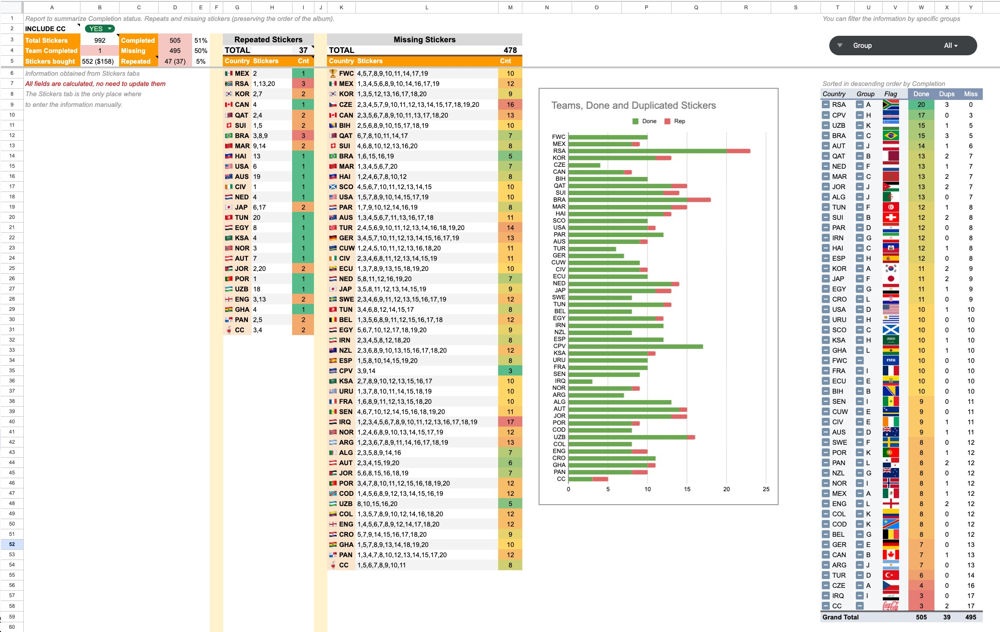

### Trade with another collector

The tracker includes a trade comparison service that helps identify possible exchanges between your collection and another collector's collection.

This service is enabled through the `Trade` tab. Paste the other collector's data in the **INPUT** section. The expected format of the input data is Format 1 (see section **Input format**). It accepts other delimiters, repeats and ranges, the formulas in the **OUTPUT** section can handle them. The sticker columns have conditional formatting that highlights any potential issue with the input data using a red background. In the **INPUT** section, `TOTAL` represents the total counts from Another Collector.

Review the generated **OUTPUT** section to see what you can offer and what you may receive.

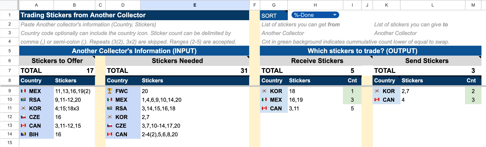

> Note: As you can see from the image it accepts different delimiters, flag icons, repeats and interprets correctly ranges in both forms: `A-B` and `A-B(X)`.

You can use it for trades where both collectors exchange the same number of stickers, or for cases where you receive more stickers and pay the difference. The `Cnt` column in the **OUTPUT** section shows the cumulative number of possible stickers to receive/send.

A green background in `Cnt` highlights values that are less than or equal to the number of stickers you can send or receive, making it easier to identify balanced or smaller trade combinations first. The `TOTAL` value indicates the maximum number of matches in each direction in the **OUTPUT** section.

In the **OUTPUT** section, the collector can sort the Receive Sticker output by either `%-Done` or `Album`. The drop-down values are located to the right of the `SORT` cell. These values have the same functionality and interpretation as in the **Share your swap status** section. For more information, please refer to the content of that section.

In the provided example, the maximum swap occurs when the cumulative number of stickers is `3`, meaning both collectors receive an equal number of stickers. This number represents the minimum `TOTAL` in both directions of the trade. You can also negotiate with another collector to send additional stickers and receive compensation for the difference. Since sorting is set to `%-Done`, the Receive Stickers output is sorted by the `Done` column from the `Stickers` tab in descending order. This facilitates completion of your album. For example, Korea is closer to completion than Mexico, so it is more beneficial for the user to obtain a missing sticker from Korea than from Mexico.

> The main advantage of this tab is that it finds matching trade opportunities. The **Export shared stickers** service from the **Manage Panini** menu only facilitates sharing information about the user's needs and available repeats, but it does not identify matches with another collector.

📌 This entire process is significantly simplified by the information provided in this tab.

### Mobile Services

Starting with release `1.1.0`, the Google Sheet Tracker includes a mobile web application that allows users to manage their album from a mobile device.

Because Google Apps Script does not provide native support for mobile add-ons, a **one-time setup is required** after making a copy of the tracker template.

To enable the mobile web application:

1. Open the Google Sheet tracker from a desktop browser.
2. Select **Manage Panini** → **Mobile Web App Link**.
3. A dialog will appear with instructions for deploying the application as a Google Apps Script **Web App**.

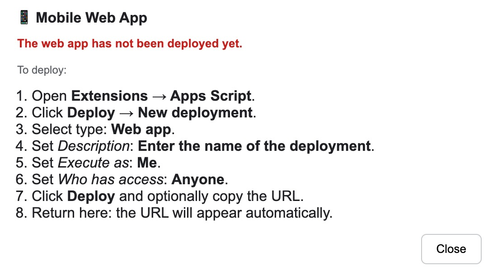

4. Follow the deployment steps shown in the dialog. When you click **New deployment**, the required deployment settings are automatically preconfigured. Just fill the Description field with the name of your preference (but you can leave it blank) and simply click **Deploy**.

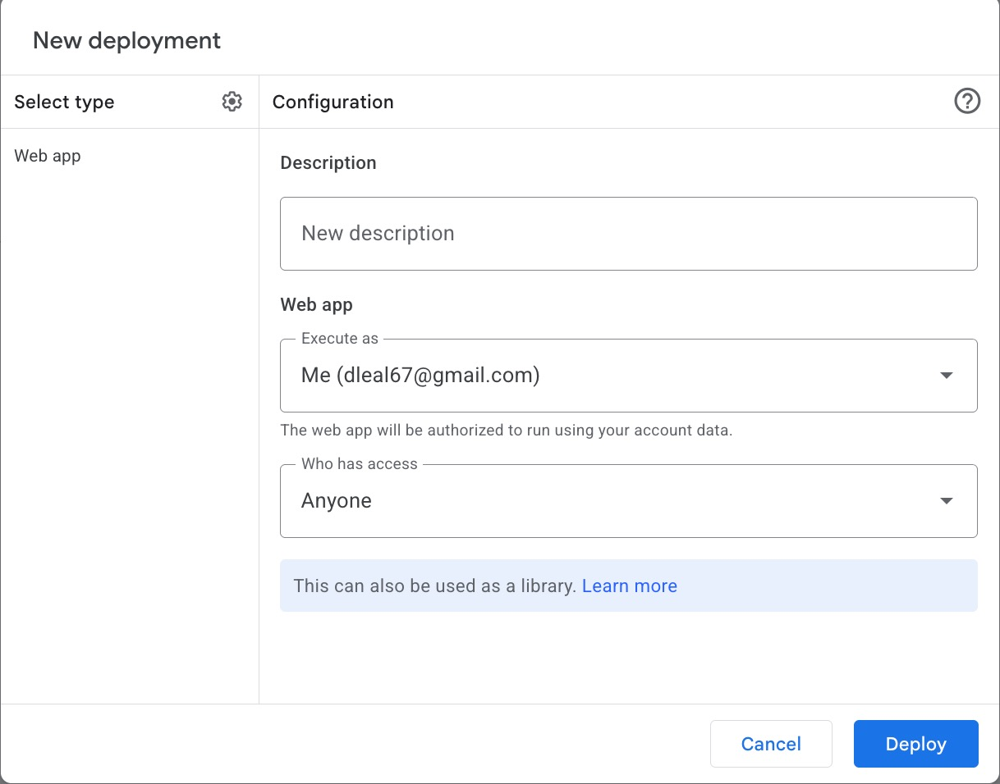

The Web App is deployed under your own Google account, ensuring that only you can access your album data.

5. After the initial deployment, select **Manage Panini** → **Mobile Web App Link** again. The dialog will now display the URL of your deployed Web App. Click on **Copy URL**.

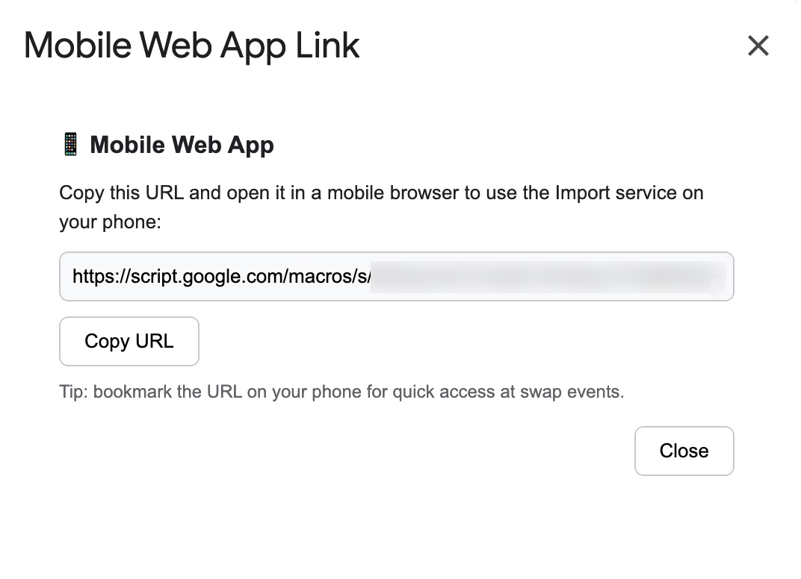

> If the URL is not displayed immediately, wait about a minute and open the **Mobile Web App Link** menu option again. This dialog is intended to make it easy to retrieve the Web App URL. Alternatively, once the deployment is complete, you can copy the URL directly from the **Manage Deployments** dialog, as shown below.

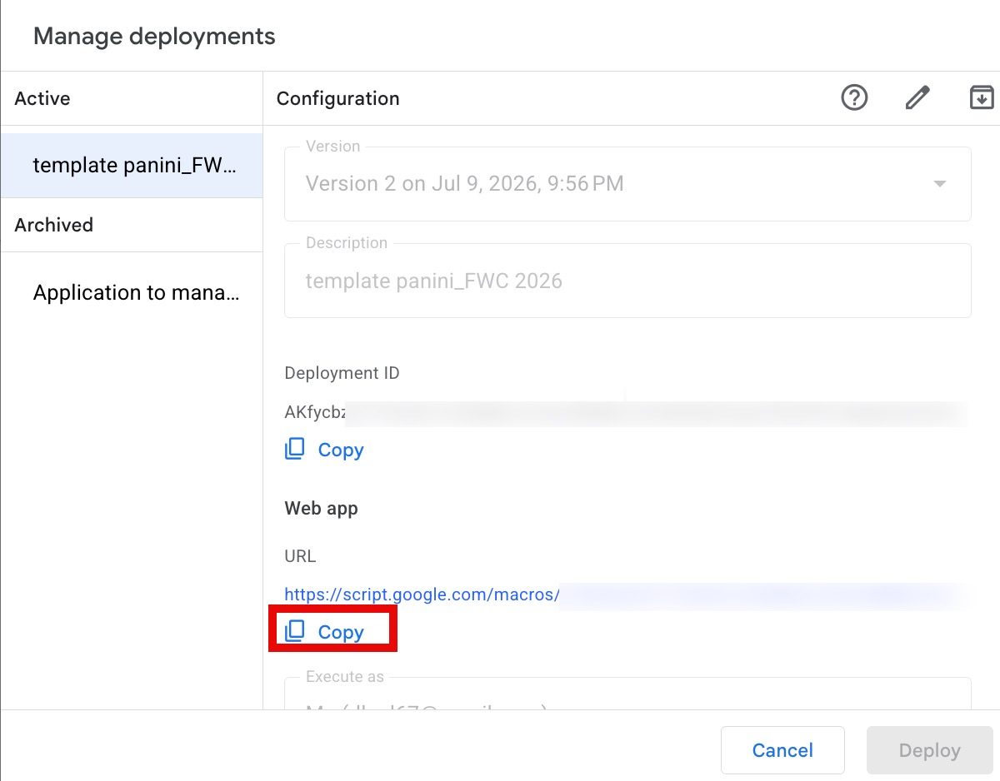

6. Open the URL from any mobile browser, or save it to your device's home screen for quick and convenient access.

The following image shows the **Quick Sticker Entry** service on a mobile device:

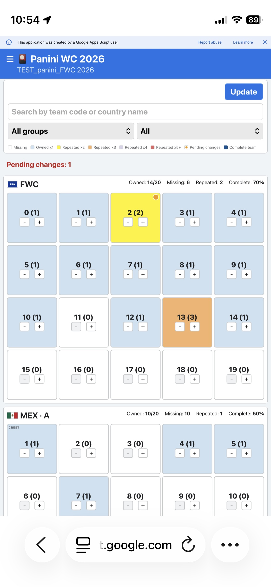

At the top, the application displays the name of your Google Sheet tracker. The **Quick Sticker Entry** view has been optimized for mobile devices by displaying a maximum of **5 sticker columns**, providing a better viewing and touch experience.

Tap the hamburger menu (&#9776;) in the upper-left corner to access the available services. The mobile application provides the same functionality as the desktop version, with interfaces simplified and optimized for mobile browsers.

**The deployment process only needs to be completed once.** After that, you can use the same Web App URL whenever you want to access the tracker from your mobile device.

Although Google Apps Script does not natively support mobile add-ons, deploying the project as a Web App provides a practical and secure solution for accessing the Google Sheet Tracker from smartphones and tablets.

---

## Manage Panini menu

The custom **Manage Panini** spreadsheet menu is added by the Apps Script project and provides access to the main supported workflows:

- Import or export (all stickers or shared stickers) collection data.
- Open the Quick Sticker Entry dialog.
- Instructions on how to deploy the Web app for mobile services.

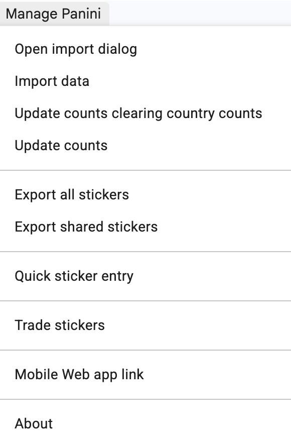

---

## Import format

The input parser considers two formats: Format 1 and Format 2. Examples:

- Format 1:
  - `MEX,1,2,3(2)` → sticker `3` is repeated `2` times.
  - 🇲🇽 `MEX,1,2,3(3)` → sticker `3` is repeated `3` times.
  - `MEX,1-3` → same as: `MEX,1,2,3`.
  - `MEX,1-3(2)` → same as: `MEX,1(2),2(2),3(2)`.
- Format 2: Similar to the sticker ID on the back of the sticker card
  - `MEX-1,MEX-2,MEX3` → the dash (`-`) is optional, as in `MEX3`.
  - 🇲🇽 `MEX-1,MEX-9-10` → same as: `MEX-1,MEX-9,MEX-10`.
  - `MEX-1,MEX-9-10(2)` → same as: `MEX-1,MEX-9(2),MEX-10(2)`.

All valid sticker values produced after parsing and validation are written to the `COUNTS` named range.

### Common syntax rules

All formats enforce the following syntax rules (for simplicity, all examples use Format 1, but the rules apply to both formats).

#### pre-normalization process
Standardization happens at a country line level and before split by token: 
 - Accepted delimiters between tokens are `,` (comma), `:` (colon), `;` (semicolon), or whitespace. However, internally, all these delimiters are converted to commas.
  - Country codes accepted in lower/upper case, but internally converted to upper case.
  - All non-ASCII characters are stripped from each line before parsing; flag emojis are removed.
  - Empty tokens produced by consecutive delimiters (e.g. `FWC,,1,2`) are silently skipped.
  - All possible repeat representations (`NxX`, `N(xX)`, `A-BxX`, `A-B(xX)`) are normalized to the canonical repeat forms: `N(X)`, `A-B(X)`.

  #### Rules
- One country per line.
- *First country rule*: The first mandatory token in the country line must be a country code; all stickers belong to this country code.
- Country codes must exist in the `COUNTRIES` named range. Invalid countries are skipped and a warning is reported.
- A sticker token must be one of the following:
  - `N` sticker number. The number must be in the valid range: `[0-20]`. Outside this range, the sticker is skipped and reported as a warning. 
  - Stickers not in the album, such as
    - `FWC,20`, `CC,0` or `MEX,0` for country teams, are accepted on input if present and populated with a count of `0`.
    - `CC,13-20`, are accepted on input if present and populated with a count of `0`.
  - `N(X)` sticker number repeated `X` times where `X > 1` (otherwise skipped and a warning is reported).
  - `A-B` sticker range from `A` to `B`, both inclusive, where `A` is lower than `B` (otherwise skipped and a warning is reported).
  - `A-B(X)` sticker range with repeats. Same as `A-B` case but repeats `X` times for each sticker in the range.
- *First-occurrence-wins rule*: The first occurrence is kept in the case of duplicated stickers within the same country line or duplicated country lines (two lines belong to the same country). Skipped stickers and country lines are reported as warnings:
  - *Duplicates*: `MEX,1,1(2),2,3` → `MEX,1,2,3`; sticker `1(2)` is skipped and reported as a warning.
  - *Duplicates in overlapping ranges*: `MEX,1-3,3-5(2)` is expanded internally as `MEX,1,2,3,3(2),4(2),5(2)`; therefore, the second occurrence of sticker `3` (`3(2)`) is skipped and reported as a warning.
  - *Duplicated country lines*: If a line contains `MEX,1,2,3` and down below another line contains `MEX,10,11,13`, the second line is skipped and reported as a warning.

### Format 1 (country code once)

Country line after pre-normalization:

```text
Format: CODE,item[,item...]
```

where each `item` is one of:
- `number`
- `number(repeats)`
- `start-end`
- `start-end(repeats)`

Please check **Common syntax rules** for the validation rules that apply.

Example:

```text
FWC,1,3,5(2),7    → sticker 5 is repeated 2 times.
🇲🇽 MEX,18,20      → owns stickers 18, 20 from Mexico.
BRA,7(3)          → stickers 7 repeated 3 times.
RSA,10-12(2)      → same as: RSA,10(2),11(2),12(2), all stickers repeated 2 times.
```

### Format 2 (Per-sticker country prefix (CODE[-]N))

Each sticker token includes the country code as a prefix. The dash between the code and the sticker number is **optional**. All current country codes in the Panini WC 2026 album are exactly three characters long on the back of the sticker card, except for Coca-Cola (`CC`) stickers; the parser relies on this fixed length and the special case of Coca-Cola, to identify the code prefix in Format 2 tokens.

Country line after pre-normalization:

```text
Format: item[,item...]
```

Where:
- each `item` is one of the following:
  - `CODE[-]number`
  - `CODE[-]number(repeats)`
  - `CODE[-]start-end`
  - `CODE[-]start-end(repeats)`
- `CODE[-]` means the country code followed by an optional dash (`-`).

Please check **Common syntax rules** for the validation rules that apply.

The *First country rule* from the **Common syntax rules** section enforces that any country different from the first one in the country line is skipped and reported as a warning. For example: `MEX1,MEX10,BRA10,ARG10,MEX20` results in `MEX1,MEX10,MEX20`, and stickers `BRA10` and `ARG10` are skipped and reported as warnings.

Example:

```text
- FWC1,FWC-3,FWC-5(2),FWC-7 → sticker 5 is repeated 2 times.
- 🇲🇽 MEX-18,MEX-20`         → same as: MEX18,MEX20.
- BRA7(3)                   → sticker 7 is repeated 3 times.
- RSA-10-12(2)              → same as: RSA10(2),RSA11(2),RSA12(2) all stickers repeated 2 times.
```

### Exclusion operator (import indicating missing cards only)

The exclusion operator allows a collector to import only the stickers they are **missing**, instead of listing all the stickers they own. It is convenient when the album is close to completion and it is easier to indicate only what is missing. When a collection is close to completion, collectors can import missing stickers first and then perform a second import for repeated stickers, simplifying data entry while still building a complete collection record.

#### Supported operator symbols

The following operator symbols are equivalent and interchangeable:

| Symbol | Background |
| ---    | --- |
| `<>`   | Spreadsheet users (Google Sheets / Excel not-equal operator) |
| `!=`   | JavaScript / Java developers |
| `^`    | Regex / set-complement notation |

#### Exclusion operator syntax

The operator prefix may be applied to any valid import line format:

```text
<OPERATOR> CODE,item[,item...]  (Format 1 or 2)
```

#### Exclusion examples

| Input | Equivalent (stickers imported) |
| --- | --- |
| `<>MEX,1,2,3` | `MEX,4,5,6,7,8,9,10,11,12,13,14,15,16,17,18,19,20` |
| `<>MEX,1,MEX-5-7` | `MEX,2,3,4,8,9,10,11,12,13,14,15,16,17,18,19,20` |
| `<>MEX,1(2),MEX-5-7(2)` | Same as `<>MEX,1,MEX-5-7` (previous row) |
| `<>FWC,1-10,12-19` | `FWC,0,11` |
| `!=MEX,1,2,3` | Same as `<>MEX,1,2,3` |
| `^MEX1,MEX2,MEX3` | Same as `<>MEX,1,2,3` |

#### Exclusion operator validation rules

- The operator must appear only at the start of the line, immediately before the first country code token.
- If more than one operator symbol appears at the start of the line, only the first is recognized; the remainder are silently ignored.
- An exclusion line must contain at least one sticker token after the country code; if no sticker tokens are present, the line is skipped and a warning is issued. To import all stickers for a country teams, use the explicit form `CODE,1-20` e.g. `MEX,1-20` or `FWC,0-19`, `CC,1-12` for non-country teams.
- If the exclusion results in an empty set (all valid positions excluded), the line produces no sticker entries and a warning is issued.
- Repeat values, if present in an exclusion line, are ignored — the complement always assigns count `1` to each resulting sticker position, and no warning is issued.

> Note: This operation is intended to facilitate user entry, but internally it is converted into Format 1.

---

## Named ranges

- `COUNTRIES`: `FIFA Code` column from the hidden `Conf` tab containing the country codes.
- `COUNTRY_NAMES`: `Name` column from the hidden `Conf` tab containing the country names used by the Quick Sticker Entry service for incremental searches by country name.
- `COUNTS`: Range from the `Stickers` tab displaying the sticker counts (number of stickers owned) for sticker numbers `0` to `20` for all countries.
- `DONE`: `Done` column from the `Stickers` tab displaying the total number of unique stickers collected for each country. This named range is used by the Quick Sticker Entry and Export Shared Stickers services.
- `FLAG_ICONS`: `Flag URL` column from the hidden `Conf` tab containing the country flag emojis. This named range is used by the export services and the Google Sheets template.
- `FLAGS`: Column containing the flag images for each country. Used in the `Stickers` tab.
- `FLAGS_URL`: `Flag` column from the hidden `Conf` tab containing the source URLs of the flag images used by the Quick Sticker Entry dialog and by the `FLAGS` named range.
- `GROUPS`: `Group` column from the hidden `Conf` tab containing the group assigned to each country code. This named range is used by the Quick Sticker Entry service and the `Reports` tab.
- `MAX_STICKERS`: `Max Stickers` column from the hidden `Conf` tab representing the maximum number of stickers each country team can have. Used to calculate the completion percentage for each team.
- `MISSING`: `Miss` column from the `Stickers` tab representing the number of missing stickers, taking into account the maximum number of stickers for each country.
- `P_COMPLETION`: `%` column from the `Stickers` tab. Used to calculate the number of completed teams while taking into account the maximum number of stickers for each team.
- `REPEATS`: `Rep` column from the `Stickers` tab.
- `TOTAL_COMPLETED_STICKERS`: Cell in the `Stickers` tab storing the total number of completed stickers.
- `TOTAL_MISSING_STICKERS`: Cell in the `Stickers` tab storing the total number of missing stickers.
- `TOTAL_REPEATED_STICKERS`: Cell in the `Stickers` tab storing the total number of unique repeated stickers.
- `TOTAL_STICKERS`: Cell in the `Reports` tab representing the total number of stickers in the album.

---

**Note:** All column-based named ranges (such as `COUNTS`, `COUNTRIES`, etc.) must contain `50` rows, representing `48` country teams plus `FWC` and `CC`.

## Named functions
The Gsheet tracker has defined some custom functions to simplify the calculation process:

- `CLEAN_STICKER_LINE(txt)`: This function is utilized in the `GET_TRADES` function and in `Trade` tab. It cleans the input data from another collector during the process of calculating matches. The cleaning process aims to standardize the sticker list to Format 1.

- `GET_STICKERS(ctry,in,isRep)`: This function retrieves the list of repeated stickers (if `isRep` is `TRUE/1`) or the list of missing stickers (if `isRep` is `FALSE/0`) for a specified country. It is used in the `Compact Swap View`, and  `Reports` tabs.

- `GET_TRADES(octry,ovals,ctry,vals,isget)`: This function takes an array of countries (`octry`) and sticker values (`ovals`) from another collector and countries (`ctry`) and values (`vals`) from the collector (owner of the tracker). It returns the matches (country and stickers) between the collectors. If the input argument `isget` is `TRUE/1`, it returns the matches of the countries and stickers that the collector will receive from another collector. In this case, the values of `octry` and `ovals` represent repeated stickers from another collector. If `isget` is `FALSE/0`, it returns the matches of the countries and stickers that the collector will send to another collector. In this case, the values of `octry` and `ovals` represent missing stickers from another collector. This named function is used in the `Trade` tab, specifically in the **OUTPUT** section.

---

## Hidden tabs

- `Conf`: Country-specific information such as flag, ISO country code, icon, name, etc.

---

## Apps Script authorization and Google unverified app warning

This tracker includes Google Apps Script features such as:

- The custom **Manage Panini** menu.
- The **Import / Export** dialogs.
- The **Quick sticker entry** dialog.
- The **Mobile web app link** dialog.

When you make your own copy of the spreadsheet and run one of these features for the first time, Google may ask you to authorize the attached Apps Script project. Depending on your Google account type and Google's OAuth rules, you may also see an **unverified app** warning in the web browser authorization flow.

See the [Step-by-Step Guide](docs/GoogleAccessStepByStep.md), which explains how to create a copy of the tracker and authorize the Apps Script project. If you have additional questions or concerns about using this Apps Script, please check the [FAQ](docs/FAQ.md).

### Recommended safety steps before authorizing

If you are unsure, you can take these steps before approving access:

1. **Make your own copy** of the spreadsheet.
2. Open **Extensions → Apps Script**.
3. Review the attached script project.
4. Compare it with the source code published in this repository.
5. Authorize it only if you are comfortable with what it does.

If you prefer not to authorize the script, you can still use the spreadsheet manually without scripted features.

---

## Documentation

Service-specific documents are available in the `docs/` folder:

- `ImportServiceRequirements.md`: functional requirements and business rules for the import service.
- `ExportServiceRequirements.md`: functional requirements and business rules for the export service.
- `QuickEntryServiceRequirements.md`: functional requirements and business rules for the Quick Sticker Entry service.
- `QuickEntryServiceMockDesign.md`: mock design notes and UI behavior references for the Quick Sticker Entry service.
- `TechnicalArchitecture.md`: comprehensive technical overview of the system architecture, file structures, development lifecycle pipelines, and core engineering design constraints governing the project.
- `FAQ.md`: Frequently Asked Questions document. It includes questions related to Google security and access for Apps Script.

---

## Testing

Since version `1.0.2`, Apps Script artifacts have been tested in a VS Code `Node.js` project using `Jest`. For more information, please refer to `docs/TechnicalArchitecture.md`. In version `1.1.1` `374` tests passed with the following coverage:

| % Statements | % Branch | % Functions | % Lines |                                     
|--------------|----------|-------------|---------|
|93.73         |    81.31 |   91.85     |   94.67 |                                            

---

## Changelog

Project history and notable updates are documented in:

- `CHANGELOG.md`

---

## Repository purpose

This repository is the main place for:

- Source code.
- Testing artifacts.
- Documentation.
- Future updates.
- Improvement history.

The project was initially announced on Reddit, but GitHub is now the primary location for ongoing development, documentation, and updates.

---

## Files

- Under the `.github` folder:
  - `action/setup-project/action.yml`: Common CI setup project.
  - `workflows/deploy.yml`: CI deployment file using Github secrets, to be executed when changes in `src/` folder, `deploy.yml` and `action.yml` files.
  - `workflows/validation.yml`: CI project validation, i.e. runs EsLint and tests.

- Under the `docs` folder:
  - `ImportExportServiceRequirements.md`: Requirements document for the import/export service.
  - `QuickEntryServiceRequirements.md`: Requirements document for the Quick Entry service.
  - `QuickEntryServiceMockDesign.md`: Mock design document for Quick Entry.
  - `GoogleAccessStepByStep.md`: Step-by-step guide explaining how to create a copy of the template and authorize the Apps Script project.
  - `TechnicalArchitecture.md`: Comprehensive technical overview of the system architecture, file structure, development lifecycle pipelines, and core engineering design constraints governing the project.
  - `FAQ.md`: Frequently Asked Questions document. It includes questions related to Google security and access for Apps Script.

- Under the `examples`folder: Export file samples. Export samples for Export all stickers are also valid input samples for Import service.
  - `panini-stickers-all.txt`: Sample of Export all stickers service.
  - `panini-stickers-all_flagTrue_compactTrue.txt`: Sample of Export all stickers service with **Flag** and **Compact (using ranges)** checkboxes activated.
  - `panini-stickers-shared.txt`: Sample of Export shared stickers service output.
  - `panini-stickers-shared_flagTrue_compactTrue.txt`: Sample of Export shared stickers service with **Flag** and **Compact (using ranges)** checkboxes activated.
 
- Under the `images` folder: Images used in the `README.md` file and `doc` folder documents.

- Under the `scripts` folder:
  - `build.js`: Prepares the `src/*.gs` and `src/html/*[Helpers|Render].html` files to be tested with Jest. It moves the files to `build` folder, change extension `.gs` $\rightarrow$ `.js`, add export module with classes and functions with `@export` tag and indicate the source file on top.
  - `clasp.zsh`: zsh script to handle clasp operations (`pull`/`push`/`deploy`) to synchronize the local VS Code environment with the GAS remote server repository and deploy a Web app for mobile services. It creates a preventive backup zip file before updating the source code (local/server).
  - `fix-jsdoc.js`: Used occasionally when ESLint doesn't fit short JSDoc comments into a single line and instead generates three-line comments.

- Under the `src` folder:
  - `Code.gs`: Spreadsheet entry points only. It contains menu creation, dialog opening functions, and thin wrapper functions callable from HTML dialogs.
  - `Commons.gs`: this shared spreadsheet provides access, named range validation, and common lookup utilities used throughout import/export and Quick Entry workflows. All these services are encapsulated within the `StickerSheetRepository` class.
  - `ImportService.gs`: Import service logic, including preview generation, import execution, and input parsing.
  - `ExportService.gs`: Export service logic, includes export all stickers and export shared stickers.
  - `QuickEntryService.gs`: Quick Sticker Entry service that builds UI-ready country view models and applies sticker count updates.

- Under the `src/html` folder:
  - `CommonsStyles.html`: Common style definitions to ensure consistency across all dialog services (desktop).
  - `ImportDialog.html`: HTML user interface for the import dialog shown inside Google Sheets.
  - `ImportHelpers.html`: Helper testable logic function used in `ImportDialog.html`.
  - `ImportExportDialogStyles.html`: Styles to be used in the Import/Export dialog for desktop version.
  - `ExportDialog.html`: HTML user interface for the export dialog shown inside Google Sheets.
  - `ExportView.html`: View and javascript functions used by export service (desktop and mobile).
  - `ExportHelpers.html`: Helper testable logic function used in `ExportDialog.html`.
  - `QuickEntryDialog.html`: HTML user interface for the Quick Sticker Entry dialog.
  - `QuickEntryView.html`: View and javascript functions used by Quick entry service (desktop and mobile).
  - `QuickEntryHelpers.html`: Helper logic functions used in `QuickEntryDialog.html`.
  - `QuickEntryRender.html`: DOM/UI-specific functions used in `QuickEntryDialog.html`.
  - `QuickEntryStyles.html`: Styles used by the Quick Sticker Entry dialog. Desktop version.
  - `MobileHome.html`: Mobile entry point which includes navigation drawer, view switching system, injected view via include.
  - `MobileImportView.html`: Simplified view for mobile import service.
  - `MobileExportView.html`: View for both export services. It acts as a wrapper.
  - `MobileQuickEntryView.html`: Specific view for mobile quick entry service. It is just a wrapper.
  - `MobileLinkDialog.html`: Provides user's instructions on how to deploy as Web App the GAS project.
  - `MobileStyles.html`: Mobile CCS specific styles, common to all mobile services.
  - `MobileImportStyles.html`: CCS specific styles for mobile import service.
  - `MobileExportStyles.html`: CCS specific styles for mobile export service.

- Under the `test/` folder:
  - `Commons.unit.test.js`: Test file for testing `src/Commons.gs`.
  - `ImportService.unit.test.js`: Test file for testing `src/ImportService.gs`.
  - `ImportHelpers.unit.test.js`: Test file for testing `src/html/ImportHelpers.gs`.
  - `ExportService.unit.test.js`: Test file for testing `src/ExportService.gs`.
  - `ExportHelpers.unit.test.js`: Test file for testing `src/html/ExportHelpers.gs`.
  - `QuickEntryService.unit.test.js`: Test file for testing `src/QuickEntryService.gs`.
  - `QuickEntryHelpers.unit.test.js`: Test file for testing `src/html/QuickEntryHelpers.gs`.
  - `QuickEntryRender.unit.test.js`: Test file for testing `src/html/QuickEntryRender.gs`.
  - `utils/testKernel.js`: Global test kernel for GAS unit tests.
  - `jest.config.js`: `Jest` configuration file.

- Under root:
  - `clasp.json.template`: Template file used for clasp operations (create, edit, and deploy locally to Apps Script).
  - `.claspignore`: Files and folders to ignore in clasp execution.
  - `.eslintignore`: Files and folders to ignore by ESLint.
  - `.eslintrc.js`: ESLint configuration (customizable rules).
  - `.gitignore`: Files and folders to ignore for git.
  - `jsconfig.json`: JavaScript project configuration file.
  - `package.json`: Node.js project configuration file (dependencies, scripts, automation tasks, etc.).
  - `CHANGELOG.md`: Chronological summary of notable project changes.
  - `README.md`: Main project overview for GitHub visitors, including features, screenshots, and usage guidance.
  - `TODO.md`: Features planned for future releases. A check mark indicates that a feature has already been implemented.

---